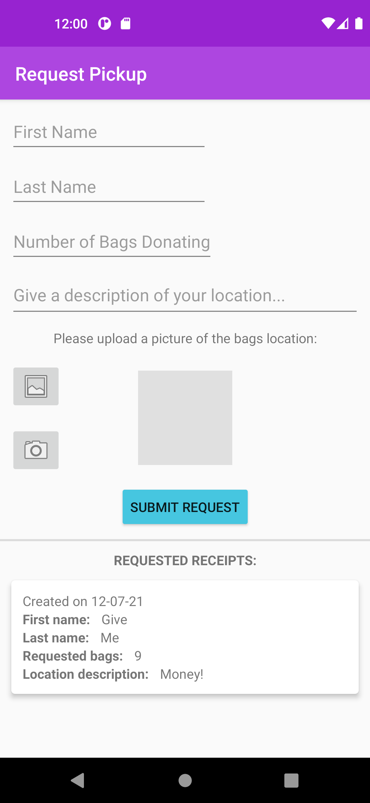

<div id="top"></div>

<h3 align="center">VVC-Donation-App</h3>

<p align="center">
  A native android mobile app that allows Vintage Values to receive donation request information. Users can post information regarding the type and location of the donation and Vintage Values can accept those donation requests.
  <br />
  <br />
</p>


## Built With

* [Android Studio](https://developer.android.com/studio)


<!-- GETTING STARTED -->
## Getting Started

### Prerequisites

1. Install Android Studio

### Installation

2. Clone the repo
   ```sh
   git clone https://github.com/grantrisk/VVC-Donation-App
   ```
3. Open project with cloned folder


<!-- USAGE EXAMPLES -->
## Screen Shots
<table>
  <tr>
    <td></td>
    <td></td>
    <td></td>
  </tr>
  <tr>
    <td></td>
    <td></td>
  </tr>
</table>

<!-- CONTACT -->
## Contact

Grant Risk - gr2257@uncw.edu


